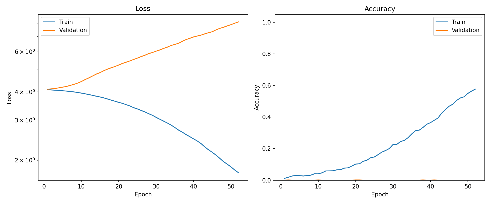
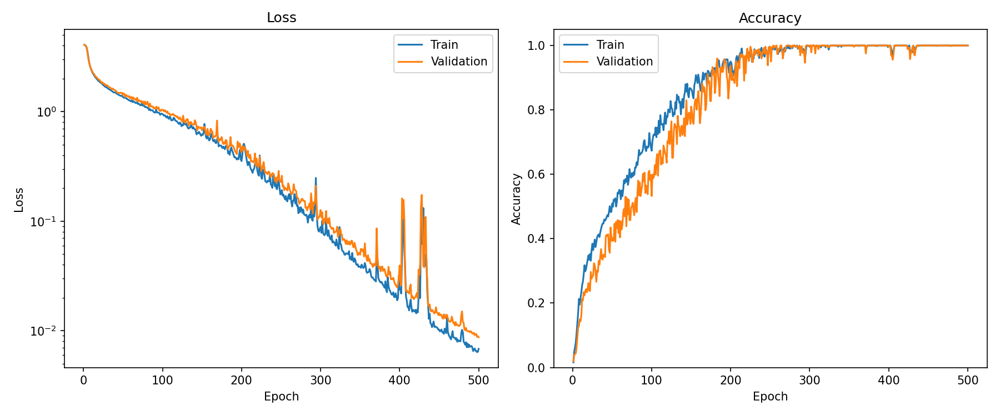
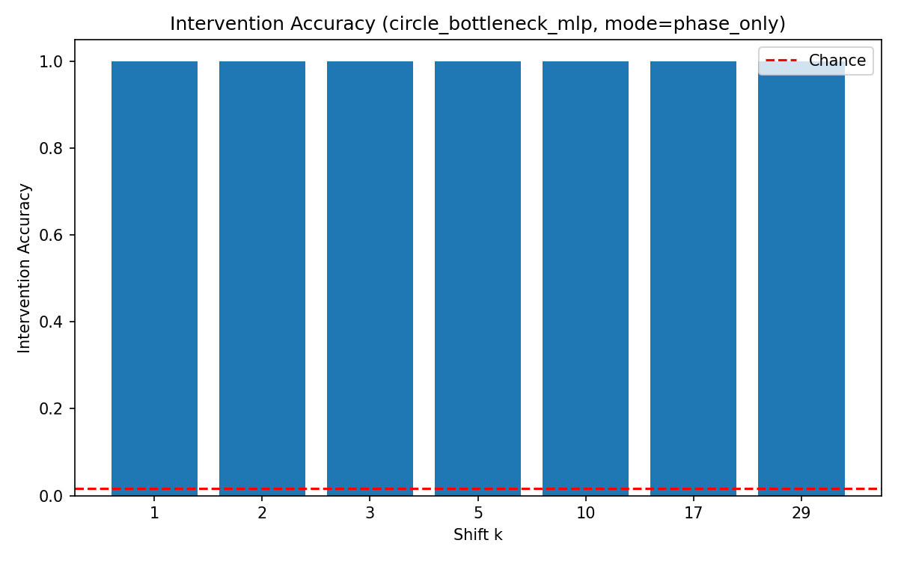
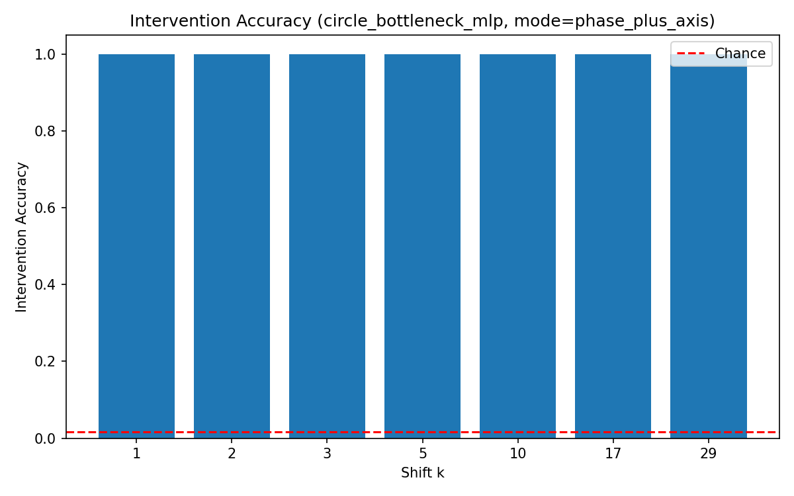
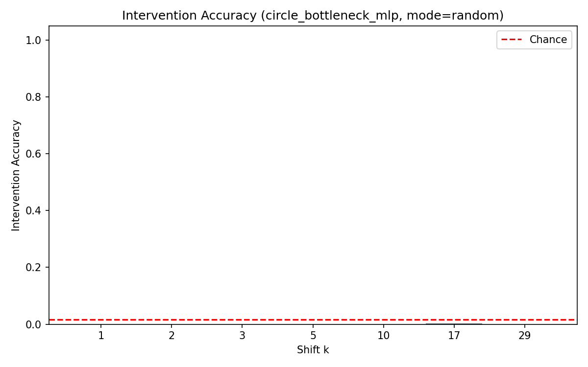
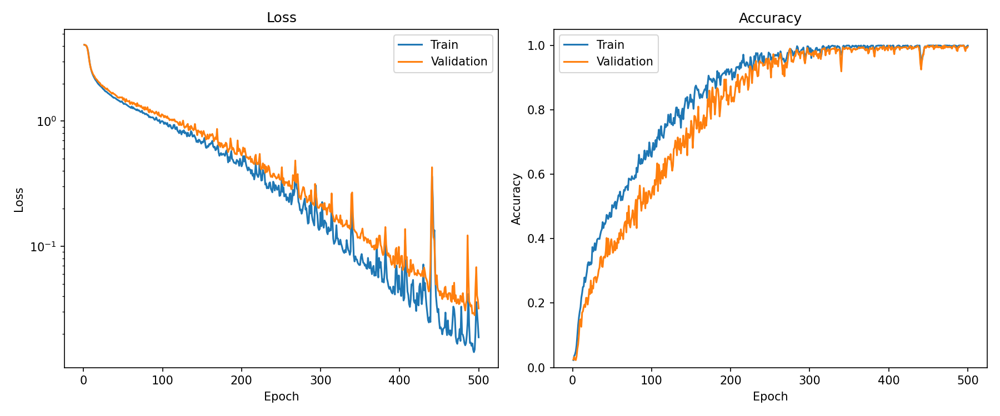
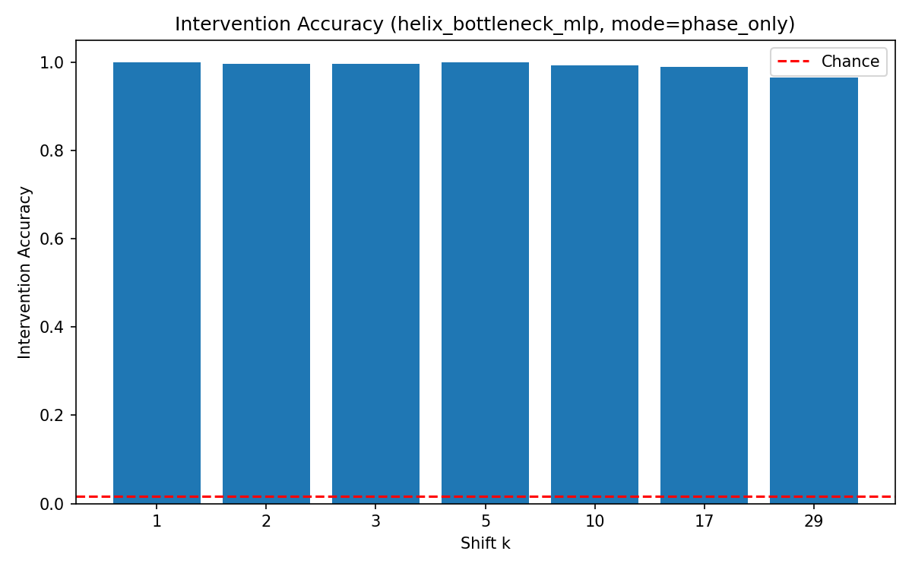
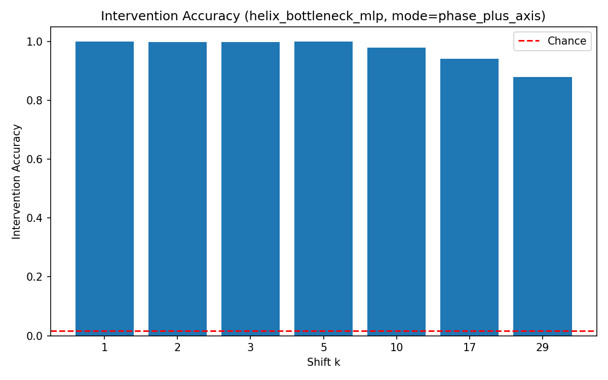
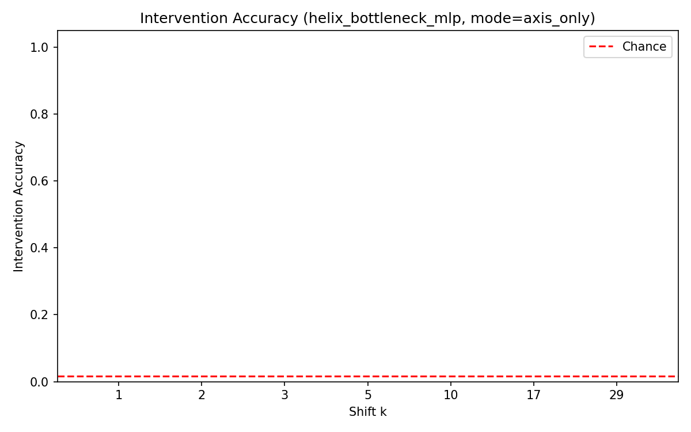
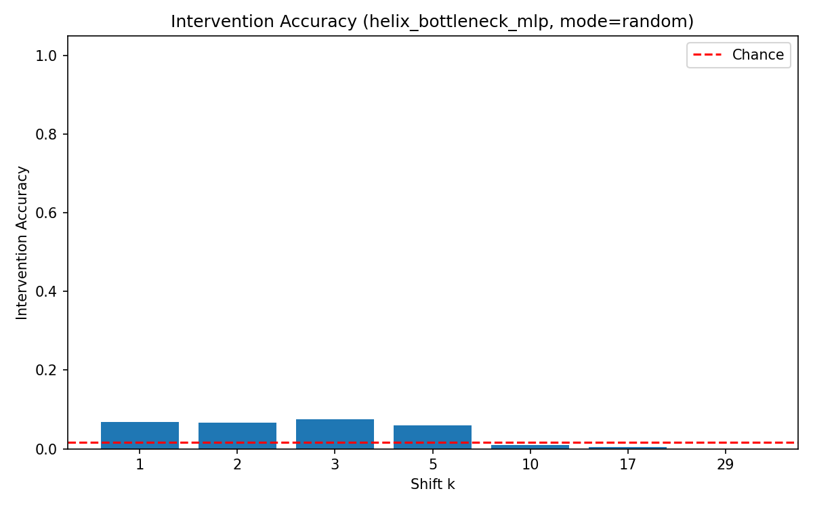

# Experimental Results: Modular Addition with Structured Latents

## Overview

This document summarizes the first modular addition experiment for the structured-latents project.

The task is:

```text
(a + b) mod N = c,    N = 59
```

Three model variants were trained and evaluated:

1. **Baseline MLP** with learned embeddings.
2. **Circle Bottleneck MLP** with explicit phase coordinates.
3. **Helix Bottleneck MLP** with explicit phase plus an axial coordinate.

The goal was not just to test whether the models could solve modular addition, but whether **rotating the latent representation produces a predictable shift in the model's output**. Concretely:

```text
If latent(a) is rotated by an amount corresponding to k,
does the model behave as though a became a + k?
```

This is the "twist the spiral, see if the answer twists with it" test.

## Summary of Results

| Model | Generalization | Best structured intervention | Random control |
|---|---:|---:|---:|
| Baseline MLP | Did not generalize within budget | N/A (no structured subspace) | 1.45% |
| Circle Bottleneck MLP | ~100% | 100.00% (phase-only) | 0.03% |
| Helix Bottleneck MLP | ~99–100% | 99.15% (phase-only) | 4.04% |

For `N = 59`, chance accuracy is approximately:

```text
1 / 59 ≈ 1.69%
```

The headline finding is that **explicit circular phase latents support clean, causal interventions**: rotating phase by `2πk/N` reliably shifts the model's output by `k mod N`. The helix model also works, but its modular-shift behavior is driven entirely by the phase component; the axial coordinate is unused for this task, as expected.

## 1. Baseline MLP

### Setup

Standard learned embeddings for `a` and `b` followed by an MLP classifier. This is the "no geometric prior" control. It tests whether an ordinary unconstrained latent space supports the same intervention behavior as the structured models.

### Training behavior

The baseline showed clear overfitting under this training budget.

```text
Training accuracy:    ~57.7% (after 52 epochs)
Validation accuracy:  ~0%
Training loss:        4.08 → 1.76 (decreasing)
Validation loss:      4.09 → 8.09 (increasing)
```



### Caveat on the baseline

Modular addition is a known grokking task. With standard cross-entropy training and a 70/15/15 split, the memorization regime can persist for thousands of epochs before validation accuracy snaps to ~100%. Replicating the published grokking phenomenon typically requires high weight decay (≈1.0), full-batch or large-batch training, and many more epochs than were used here.

The baseline in this run was **not trained to convergence**. The 0% validation accuracy reflects "memorization phase, no grokking yet" rather than "this architecture cannot solve the task." Comparisons between the baseline and the bottleneck models in this document should be read as comparisons of *training efficiency under matched budgets*, not as claims about asymptotic capability.

### Intervention behavior

Only a random latent perturbation control was run on the baseline. Structured rotation interventions are not meaningfully defined here, since the model has no designated circular subspace.

```text
Random latent perturbation accuracy: 1.45%   (≈ chance for N=59)
```

This is the expected null result: perturbing an unstructured latent produces random outputs.

### Interpretation

The baseline did not generalize within this budget. Its random-perturbation behavior is a useful negative control: ordinary learned embeddings under this configuration do not produce predictable shift behavior under arbitrary latent perturbations. Whether they would after grokking is an open question this experiment does not answer.

## 2. Circle Bottleneck MLP

### Setup

Each input number is represented by explicit phase coordinates:

```text
circle(a) = [cos(2πa/N), sin(2πa/N)]
```

The model receives circular representations for both `a` and `b` and predicts `c` through an MLP head.

### Training behavior

Both train and validation accuracy reached approximately 100%. The explicit circular representation was sufficient for the model to learn modular addition and generalize to held-out pairs.



### Intervention behavior

Rotation interventions were applied to the circular subspace of `latent(a)` for shifts `k ∈ {1, 2, 3, 5, 10, 17, 29}`. Two rotation modes were evaluated. They are equivalent for this model, since there is no axial coordinate.

| Intervention mode | Overall accuracy |
|---|---:|
| Phase only | **100.00%** |
| Phase + axis | **100.00%** |
| Random control | 0.03% |

The 0.03% on the random control corresponds to a single correct prediction out of 3,661 examples, which is *below* chance. This indicates that random rotations actively destroy the model's signal — the representation is tightly coupled to the structured subspace.







### Interpretation

This is the cleanest positive result in the experiment. Rotating the circular latent by `2πk/N` causes the model to output `(a + k + b) mod N` with perfect reliability across all tested shifts. The circular phase functions as a directly manipulable causal variable for the modular-addition computation.

The strength of this result is bounded by the experimental setup: the circle subspace is the *only* path the value of `a` takes into the network. Rotation-equivariance of the downstream MLP in that subspace is therefore close to forced. What this experiment confirms is that the rotation pipeline is correctly implemented and the readout behaves as predicted; it does not yet show that geometric structure is something models can usefully *discover*.

## 3. Helix Bottleneck MLP

### Setup

Each input number is represented as:

```text
helix(a) = [cos(2πa/N), sin(2πa/N), αa]
```

with α = 1/N. The first two coordinates encode circular phase; the third encodes monotonic axial progress.

For pure modular addition, the cyclic component is expected to be the relevant one. The axial coordinate is included to set up later experiments where it should carry useful information.

### Training behavior

```text
Training accuracy:    99.95%
Validation accuracy:  99.62%
Training loss:        4.08 → 0.018 (over 500 epochs)
```

The helix representation was sufficient for the model to solve the task at near-perfect accuracy.



### Intervention behavior

Four intervention modes were evaluated.

| Intervention mode | Overall accuracy | Interpretation |
|---|---:|---|
| Phase only | **99.15%** | Strong causal effect from phase rotation |
| Phase + axis | **97.08%** | Strong, but degrades at large shifts |
| Axis only | **0.00%** | No causal role in the modular computation |
| Random control | **4.04%** | Above chance, well below structured interventions |

#### Per-shift breakdown

Phase-only:

| Shift `k` | Accuracy |
|---:|---:|
| 1 | 100.00% |
| 2 | 99.62% |
| 3 | 99.62% |
| 5 | 100.00% |
| 10 | 99.24% |
| 17 | 99.04% |
| 29 | 96.56% |

Phase+axis:

| Shift `k` | Accuracy |
|---:|---:|
| 1 | 100.00% |
| 2 | 99.81% |
| 3 | 99.81% |
| 5 | 100.00% |
| 10 | 97.90% |
| 17 | 94.07% |
| 29 | 87.95% |









### Interpretation

Three things worth pulling out of this table.

**Phase-only matches the circle model's behavior.** The helix model uses circular phase as its primary causal variable for modular addition, exactly as the geometry of the task predicts.

**Axis-only at 0% is positive evidence, not a deficiency.** Modular addition has no use for an unbounded monotonic coordinate. A model that correctly identifies phase as the relevant component should produce *exactly* 0% accuracy under axis-only intervention. This result confirms the model has learned to route the modular computation through phase rather than through the axis.

**The phase+axis degradation at large k is a clean OOD-on-the-axis signature.** With α = 1/N, a shift of k=29 pushes the axial coordinate by 29/59 ≈ 0.49 — about half the dynamic range the model ever saw during training. The phase-only and phase+axis numbers are nearly identical at small shifts (both essentially 100% for k ≤ 5) and diverge as k grows (96.56% vs 87.95% at k=29). The rate of divergence tracks the magnitude of the off-distribution axial perturbation. Interpretation: the network learned to *mostly but not perfectly* ignore the axis, and the phase+axis intervention progressively breaks that approximate invariance as it shoves z further from the training distribution.

The 4.04% random control is meaningfully higher than the circle model's 0.03% but still well below chance-shift accuracy under structured interventions. The most likely explanation is that the extra axial dimension gives the network a slightly looser representation; the gap is small enough that it could also be variance across runs.

## Main Takeaways

### 1. Explicit phase geometry supports clean causal interventions

The strongest claim supported by this experiment: rotating an explicit circular phase latent by `2πk/N` causes the model to behave as though the represented number changed by `k`. This holds for the circle model at 100% and for the helix model's phase component at 99.15%.

### 2. The helix correctly identified phase as the relevant axis

The 0% axis-only intervention accuracy is the predicted result for a network that has correctly learned to ignore the irrelevant component of its input geometry. The OOD degradation pattern in phase+axis confirms the axis was being approximately ignored, not actively used.

### 3. The baseline contrast is about training efficiency, not capability

The baseline did not grok within 52 epochs. This was expected and replicates the well-known grokking phenomenon. The bottleneck models solve the task quickly because the geometric prior hands them what the baseline would otherwise need to discover. Whether the bottleneck models also win against a fully-grokked baseline is not yet tested.

### 4. The scope of the claim is narrow

These results show:

```text
When a model is given an explicit phase latent for a cyclic task,
it can learn to use that latent in a causally predictable way.
```

These results do **not** show:

- that helical latents are generally superior to unconstrained representations;
- that real-world neural networks need or benefit from imposed helix structure;
- that geometric priors win against converged baselines on this task;
- that models can usefully *discover* helix structure when it is not imposed.

The result is a verified pipeline and a clean baseline data point, not a broad claim about geometric latents.

## Implications for Next Experiments

Two directions matter, and they are different in kind.

### A. Tasks where the axial coordinate has to do work

Pure modular addition is a circle task; the axis was decorative here. To meaningfully compare helix-vs-circle, the task needs to combine cyclic and monotonic structure so both components carry information. Candidates:

```text
integer addition with both modular and absolute outputs
counting with periodic resets
calendar arithmetic
line wrapping (column index + total characters)
musical beat-and-measure prediction
```

A successful result on one of these would show: phase-only intervention shifts the cyclic part of the answer, axis-only intervention shifts the monotonic part, and neither alone is sufficient — i.e., the helix is doing work the circle cannot.

### B. Learned rather than imposed geometry

The current experiment imposes the helix as input encoding. The downstream MLP has no choice but to be rotation-equivariant in that subspace, because that subspace *is* the input. The more informative version of the question is whether a model can be *encouraged* to organize its internal representation helically — through architecture, regularization, or task design — rather than handed it.

Two possible setups:

1. Train a small unconstrained MLP/transformer on modular addition until it groks. Then probe for circular structure in its hidden state and run the rotation intervention on the *discovered* subspace. If interventions work on the post-hoc circle, that's evidence that models naturally learn manipulable geometric variables.
2. Define a model with a learnable 2D subspace and a regularizer that encourages activity in that subspace to lie on a circle, but do not specify which 2D subspace. Train, then test whether the resulting representation is rotation-equivariant under intervention.

Direction B is the one that distinguishes this project from "we wired in a circle and the circle worked." Direction A produces interesting results regardless of outcome and is probably a faster experiment to set up.

## Source Artifacts

```text
baseline_mlp:
  training_history.json
  intervention_random.json

circle_bottleneck_mlp:
  training_history.json
  intervention_phase_only.json
  intervention_phase_plus_axis.json
  intervention_random.json

helix_bottleneck_mlp:
  training_history.json
  intervention_phase_only.json
  intervention_phase_plus_axis.json
  intervention_axis_only.json
  intervention_random.json
```