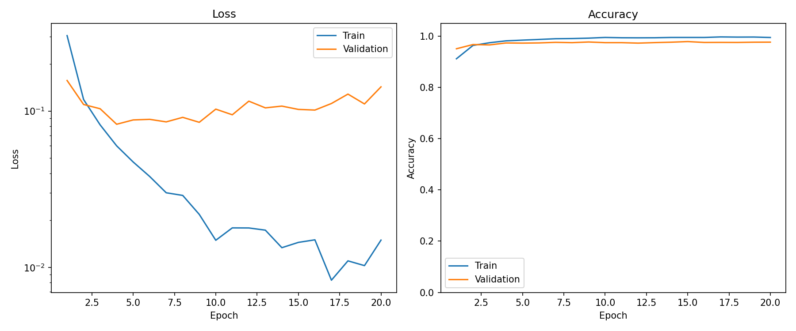
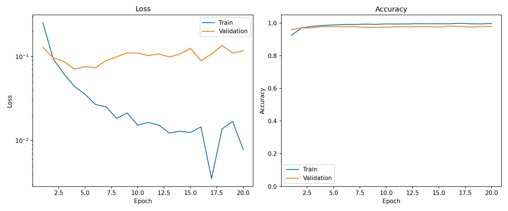
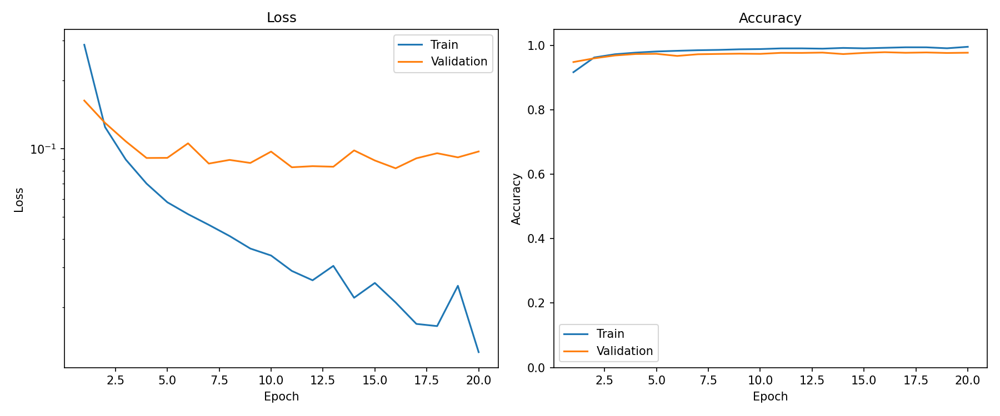
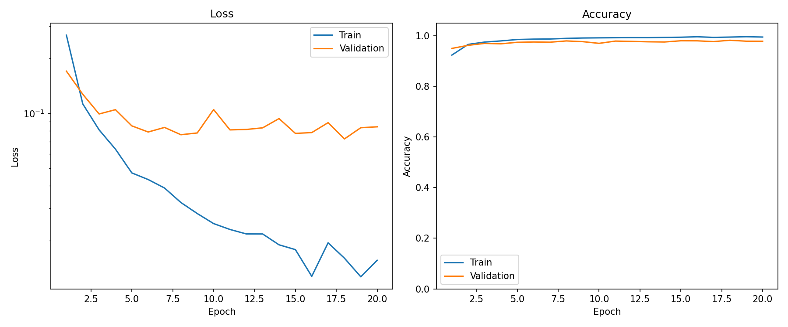

# Experimental Results: MNIST with HelixLayer Models

## Overview

This document summarizes the MNIST experiment for the structured-latents project.

The task is standard digit classification:

```text
image ∈ R^(1×28×28) → digit class ∈ {0, 1, ..., 9}
```

Four model variants were trained and evaluated:

1. **Standard MLP** with ordinary dense layers.
2. **Parameter-matched Standard MLP** with a larger dense hidden size.
3. **Circle MLP** using CircleLayer blocks with phase/radius features.
4. **Helix MLP** using HelixLayer blocks with phase/radius/axis features.

The goal was different from the modular-addition experiment. Here, MNIST does not provide an obvious ground-truth cyclic or helical latent. The purpose was to test whether the geometric layers are viable as general trainable neural network components on an ordinary classification task.

Concretely:

```text
Can CircleLayer and HelixLayer train, generalize, and compete with dense MLP baselines on MNIST?
```

This is a viability experiment, not a claim of general superiority.

## Summary of Results

| Model | Parameters | Best validation accuracy | Test accuracy | Test loss |
|---|---:|---:|---:|---:|
| Standard MLP | 118,282 | 97.90% | 97.74% | 0.08695 |
| Standard MLP, parameter-matched | 269,322 | 98.16% | **98.39%** | 0.08539 |
| Circle MLP | 200,970 | 97.92% | 97.95% | **0.07700** |
| Helix MLP | 308,618 | **98.22%** | 98.19% | 0.07965 |

The headline finding is that **both geometric models trained successfully and generalized well on MNIST**. The Helix MLP outperformed the Circle MLP and the smaller Standard MLP in accuracy, but did not beat the parameter-matched dense MLP on test accuracy in this run.

The strongest cautious claim supported here is:

```text
HelixLayer is viable as a trainable feedforward component for ordinary image classification.
```

The result does not yet show that HelixLayer is better than dense layers under fair parameter- and compute-matched comparisons.

## 1. Standard MLP

### Setup

The Standard MLP is the smallest dense baseline. It uses ordinary linear layers with GELU activations.

This model provides a sanity-check baseline for MNIST classification with no geometric layer.

### Training behavior

The model trained cleanly and reached high accuracy quickly.

```text
Parameters:                118,282
Best epoch:                14
Best validation accuracy:  97.90%
Test accuracy:             97.74%
Test loss:                 0.08695
```

Training accuracy rose from approximately 91.2% to approximately 99.5% over 20 epochs. Validation accuracy rose quickly, peaked at 97.90%, and then fluctuated slightly.

There is mild late overfitting: training loss continued to decrease while validation loss became noisier and drifted upward in later epochs. This is expected for a small dense model trained for a fixed 20-epoch budget.



### Interpretation

The Standard MLP is a competent baseline. It establishes that the training pipeline is healthy and that MNIST is being solved at the expected level for this class of model.

Any geometric model should be compared against this baseline, but also against the larger parameter-matched dense model below.

## 2. Parameter-Matched Standard MLP

### Setup

The parameter-matched Standard MLP uses the same ordinary dense-layer architecture, but with a larger hidden dimension to better match the parameter scale of the geometric models.

This is the fairer dense baseline for judging whether the geometric layers offer a performance advantage.

### Training behavior

This model was the strongest test-accuracy performer in the run.

```text
Parameters:                269,322
Best epoch:                15
Best validation accuracy:  98.16%
Test accuracy:             98.39%
Test loss:                 0.08539
```

Training accuracy reached approximately 99.75% by the final epoch. Validation accuracy peaked at 98.16% and remained in the high-97% to low-98% range afterward.

As with the smaller dense model, validation loss became somewhat noisy late in training, but the model remained stable and generalized well.



### Interpretation

This is the current performance bar for the geometric models.

The parameter-matched dense baseline outperformed both Circle MLP and Helix MLP on test accuracy in this run. This means the MNIST results do not support a claim that the geometric layers are superior to dense MLPs on ordinary classification.

They do, however, provide a useful comparison point: the Helix MLP comes reasonably close to this stronger dense baseline.

## 3. Circle MLP

### Setup

The Circle MLP replaces ordinary hidden layers with CircleLayer blocks.

Each CircleLayer learns pairs of projection directions and computes phase/radius features from them. It does not include an axial coordinate.

Conceptually, the layer exposes features such as:

```text
sin(theta)
cos(theta)
r
r * sin(theta)
r * cos(theta)
```

The goal is to test whether a phase/radius-based layer is trainable on ordinary classification.

### Training behavior

The Circle MLP trained successfully and generalized well.

```text
Parameters:                200,970
Best epoch:                15
Best validation accuracy:  97.92%
Test accuracy:             97.95%
Test loss:                 0.07700
```

Training accuracy rose from approximately 91.7% to approximately 99.6%. Validation accuracy reached 97.92%, slightly above the smaller Standard MLP's best validation accuracy and below the parameter-matched dense baseline.

The Circle MLP achieved the lowest test loss among the four models in this run, despite not having the highest test accuracy.



### Interpretation

The Circle MLP is viable. It trains normally, generalizes, and slightly improves on the smaller Standard MLP's test accuracy:

```text
Circle MLP:    97.95%
Standard MLP:  97.74%
```

However, it does not beat the parameter-matched dense baseline:

```text
Circle MLP:                    97.95%
Parameter-matched Standard MLP: 98.39%
```

The lower test loss is interesting but should not be overinterpreted from a single run. It may indicate different confidence or calibration behavior, but that requires dedicated calibration metrics and multiple seeds.

## 4. Helix MLP

### Setup

The Helix MLP uses HelixLayer blocks.

Each HelixLayer learns a 3D subspace per unit and computes phase/radius/axis features:

```text
a = x · u
b = x · v
z = x · w
r = sqrt(a^2 + b^2)
sin(theta) = b / r
cos(theta) = a / r
```

The layer then exposes nonlinear features derived from phase, radius, and axis before projecting back to an ordinary hidden vector.

Unlike the modular-addition experiment, the helix geometry here is not imposed by the task. The layer is used as a general architectural primitive.

### Training behavior

The Helix MLP trained successfully and achieved the highest validation accuracy in this run.

```text
Parameters:                308,618
Best epoch:                17
Best validation accuracy:  98.22%
Test accuracy:             98.19%
Test loss:                 0.07965
```

Training accuracy rose from approximately 92.4% to approximately 99.5%. Validation accuracy peaked at 98.22%. The validation curve was somewhat noisy but stable.



### Interpretation

The Helix MLP is the strongest geometric model in this experiment.

It outperformed both the Circle MLP and the smaller Standard MLP on test accuracy:

```text
Helix MLP:     98.19%
Circle MLP:    97.95%
Standard MLP:  97.74%
```

It did not beat the parameter-matched Standard MLP:

```text
Helix MLP:                      98.19%
Parameter-matched Standard MLP:  98.39%
```

The most important result is therefore not "HelixLayer wins on MNIST." It is:

```text
HelixLayer trains stably and reaches competitive MNIST accuracy.
```

That is a meaningful viability result. It says the helix-native computation does not break optimization or generalization on a simple non-arithmetic classification task.

## Main Takeaways

### 1. HelixLayer is viable on MNIST

The Helix MLP trained normally, generalized well, and achieved 98.19% test accuracy. This is the main positive result of the experiment.

MNIST is not a helical task. A model that uses HelixLayer successfully here is at least capable of functioning as a general feedforward classifier.

### 2. CircleLayer is also viable, but weaker than HelixLayer here

The Circle MLP reached 97.95% test accuracy. This is slightly above the smaller Standard MLP but below the Helix MLP and the parameter-matched dense baseline.

The Helix MLP's advantage over Circle MLP suggests that the additional axis-related features may help on this architecture/dataset, but this should not be treated as proof of axis utility without ablations.

### 3. Dense MLP remains the strongest test-accuracy baseline

The parameter-matched Standard MLP achieved the best test accuracy at 98.39%.

This matters. The geometric models are competitive, but this run does not show that they outperform ordinary dense layers under comparable scale.

### 4. Parameter matching is still imperfect

The parameter counts are not identical:

```text
Parameter-matched Standard MLP: 269,322
Circle MLP:                    200,970
Helix MLP:                     308,618
```

The Helix MLP has about 14.6% more parameters than the parameter-matched Standard MLP, while the Circle MLP has about 25.4% fewer. Future comparisons should tighten parameter matching or report accuracy-vs-parameter curves.

### 5. This experiment tests trainability, not causal geometry

The modular-addition experiment tested causal geometric interventions. This MNIST experiment does not yet do that. It only tests whether geometric layers can train and generalize in a standard classification setting.

A stronger interpretability experiment would inspect learned helix bases, phase distributions, feature usage, or latent interventions.

## Scope of the Claim

These results show:

```text
HelixLayer and CircleLayer can be trained successfully on MNIST classification.
HelixLayer is competitive with dense MLP baselines in this small experiment.
```

These results do **not** show:

- that HelixLayer is generally superior to dense layers;
- that helical geometry is necessary for MNIST;
- that MNIST contains natural helical structure;
- that the axis coordinate is causally important;
- that the result is stable across seeds;
- that the geometric models are compute-efficient.

The result is a viability data point, not a broad architecture claim.

## Implications for Next Experiments

Three directions are useful.

### A. Multi-seed MNIST confirmation

Before drawing architectural conclusions, repeat the experiment across several seeds:

```text
seed ∈ {0, 1, 2, 3, 4}
```

Report mean and standard deviation for:

```text
best validation accuracy
test accuracy
test loss
training time
```

This will distinguish real differences from seed noise.

### B. Parameter and compute sweeps

Run each model across multiple widths or unit counts and plot:

```text
test accuracy vs parameter count
test accuracy vs training time
test accuracy vs FLOPs, if available
```

A single parameter setting is not enough to know whether HelixLayer scales better or worse than dense layers.

### C. Move to tasks with more meaningful geometry

MNIST is useful as a viability test, but it does not specifically reward phase or helix structure.

Next tasks should include:

```text
Fashion-MNIST
rotated MNIST
rotated MNIST with class + angle heads
flattened CIFAR-10
synthetic spiral image classification
```

The most informative next step is likely rotated MNIST with two heads:

```text
digit class prediction
rotation angle prediction
```

That would test ordinary classification and phase-sensitive representation in the same model.

## Suggested Follow-Up Ablations

To understand what the HelixLayer is actually using, run feature ablations:

```text
phase-only features
raw projection features
axis-only features
phase-axis interaction features
full feature set
```

This matters because some HelixLayer features are equivalent to ordinary learned projections:

```text
r * sin(theta) = b
r * cos(theta) = a
```

Those terms are useful for stability, but they also provide a dense-layer-like path. Ablations can separate the contribution of geometric normalization from ordinary projection capacity.

## Source Artifacts

```text
standard_mlp:
  history.json
  metrics.json

standard_mlp_matched:
  history.json
  metrics.json

circle_mlp:
  history.json
  metrics.json

helix_mlp:
  history.json
  metrics.json
```
