# Experimental Results: Flattened CIFAR-10 with Geometric MLP Layers

## Overview

This document summarizes the flattened CIFAR-10 experiment for the structured-latents project.

The task is standard CIFAR-10 image classification, but with all images flattened into vectors before being passed to fully connected models:

```text
image ∈ R^(3×32×32) → flattened x ∈ R^3072 → class ∈ {0, ..., 9}
```

The ten CIFAR-10 classes are:

```text
airplane, automobile, bird, cat, deer, dog, frog, horse, ship, truck
```

Four model families were compared:

1. **Standard MLP** with ordinary dense layers.
2. **Parameter-matched Standard MLP** with larger dense hidden width.
3. **Circle MLP** using CircleLayer blocks with phase/radius features.
4. **Helix MLP** using HelixLayer blocks with phase/radius/axis features.

Each model family was trained at three parameter scales:

```text
small
medium
large
```

All models were trained for:

```text
100 epochs
seed = 0
input = flattened pixels
no convolution
no data augmentation
```

The purpose of this experiment was not to compete with convolutional neural networks. Flattened CIFAR-10 is intentionally hostile to fully connected architectures because it removes the locality bias that CNNs normally exploit.

The central question was:

```text
Can CircleLayer and HelixLayer remain competitive with dense MLPs on a hard, nonlocal pixel-classification task?
```

The main result is positive: **Circle MLP and Helix MLP outperform dense MLP baselines across all tested scales, while training at roughly the same wall-clock epoch rate.**

## Summary of Results

| Model | Scale | Parameters | Best Val Acc | Test Acc | Test Loss | Mean Epoch Time |
|---|---|---:|---:|---:|---:|---:|
| Standard MLP | small | 855,050 | 53.24% | 53.02% | 2.1681 | 12.56s |
| Standard MLP, matched | small | 1,331,722 | 53.80% | 52.90% | 2.7725 | 12.73s |
| Circle MLP | small | 1,184,266 | **57.40%** | 56.57% | **1.3953** | 12.86s |
| Helix MLP | small | 1,807,114 | 56.92% | **56.68%** | 1.9697 | 12.81s |
| Standard MLP | medium | 1,841,162 | 53.78% | 52.89% | 3.0951 | 12.78s |
| Standard MLP, matched | medium | 2,958,346 | 54.12% | 52.97% | 3.4432 | 12.45s |
| Circle MLP | medium | 3,154,954 | 57.50% | 57.35% | **1.4153** | **12.49s** |
| Helix MLP | medium | 4,859,402 | **57.72%** | **57.93%** | 2.3641 | 12.58s |
| Standard MLP | large | 4,206,602 | 54.04% | 52.71% | 3.8857 | **12.38s** |
| Standard MLP, matched | large | 7,096,330 | 53.06% | 52.74% | 3.9935 | 12.47s |
| Circle MLP | large | 9,455,626 | 57.86% | **58.32%** | **2.6052** | 12.55s |
| Helix MLP | large | 14,699,530 | **58.08%** | 57.87% | 2.9340 | 12.62s |

The best test accuracy in this run was:

```text
Circle MLP, large: 58.32%
```

The best Helix MLP test accuracy was:

```text
Helix MLP, medium: 57.93%
```

The best dense MLP test accuracy was:

```text
Standard MLP, small: 53.02%
```

The best parameter-matched dense MLP test accuracy was:

```text
Standard MLP matched, medium: 52.97%
```

## Main Result

The geometric MLPs outperformed the dense MLP baselines at every tested scale.

Compared against the parameter-matched dense baseline:

| Scale | Dense Matched Test Acc | Circle Test Acc | Circle Gain | Helix Test Acc | Helix Gain |
|---|---:|---:|---:|---:|---:|
| small | 52.90% | 56.57% | +3.67 pts | 56.68% | +3.78 pts |
| medium | 52.97% | 57.35% | +4.38 pts | 57.93% | +4.96 pts |
| large | 52.74% | 58.32% | +5.58 pts | 57.87% | +5.13 pts |

This is the first experiment in the project where the geometric-layer models outperform dense MLP baselines on a non-toy, non-arithmetic, non-geometry-rigged classification benchmark.

## Training Rate Result

Training rate is an important part of this experiment.

Despite large parameter-count differences, mean epoch time was very similar across models:

```text
minimum mean epoch time: 12.38s
maximum mean epoch time: 12.86s
range: 0.48s
```

Across the full sweep, the slowest model by mean epoch time was:

```text
Circle MLP small: 12.86s/epoch
```

The fastest model by mean epoch time was:

```text
Standard MLP large: 12.38s/epoch
```

This means the geometric models did not achieve their accuracy gains by paying an obvious wall-clock cost in this implementation.

This is especially notable for the large models:

| Model | Scale | Parameters | Test Acc | Mean Epoch Time |
|---|---|---:|---:|---:|
| Standard MLP | large | 4,206,602 | 52.71% | 12.38s |
| Standard MLP, matched | large | 7,096,330 | 52.74% | 12.47s |
| Circle MLP | large | 9,455,626 | 58.32% | 12.55s |
| Helix MLP | large | 14,699,530 | 57.87% | 12.62s |

The cautious interpretation is:

```text
In this local implementation, Circle MLP and Helix MLP improved test accuracy without a meaningful mean-epoch-time penalty.
```

This should not yet be interpreted as a general compute-efficiency claim. It should be confirmed with more detailed profiling before making claims about FLOPs or hardware efficiency.

## 1. Dense MLP Baselines

### Setup

The dense baselines are ordinary fully connected networks operating on flattened CIFAR-10 pixels.

Two dense variants were used:

```text
standard_mlp
standard_mlp_matched
```

The parameter-matched version increases dense hidden width to provide a stronger baseline against the larger geometric models.

### Results

| Model | Scale | Parameters | Best Val Acc | Test Acc | Test Loss | Mean Epoch Time |
|---|---|---:|---:|---:|---:|---:|
| Standard MLP | small | 855,050 | 53.24% | 53.02% | 2.1681 | 12.56s |
| Standard MLP | medium | 1,841,162 | 53.78% | 52.89% | 3.0951 | 12.78s |
| Standard MLP | large | 4,206,602 | 54.04% | 52.71% | 3.8857 | 12.38s |
| Standard MLP, matched | small | 1,331,722 | 53.80% | 52.90% | 2.7725 | 12.73s |
| Standard MLP, matched | medium | 2,958,346 | 54.12% | 52.97% | 3.4432 | 12.45s |
| Standard MLP, matched | large | 7,096,330 | 53.06% | 52.74% | 3.9935 | 12.47s |

**Figure: Standard MLP, small scale (855K params)**
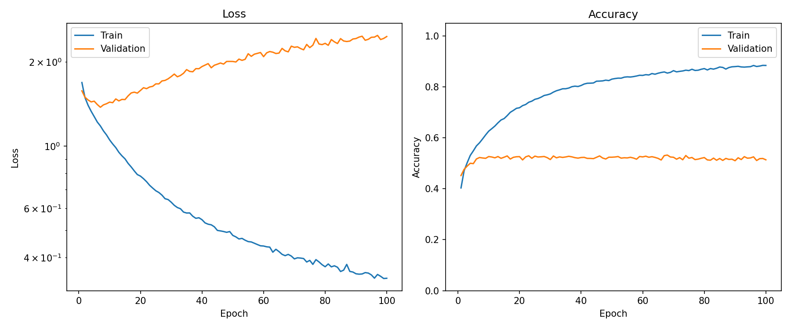

**Figure: Standard MLP, medium scale (1.8M params)**
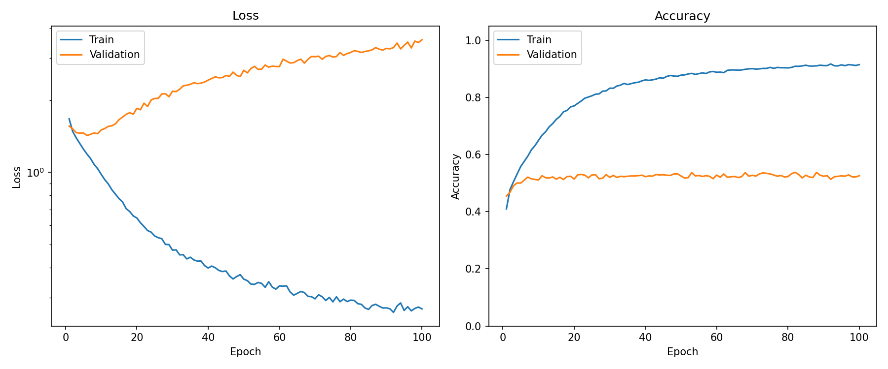

**Figure: Standard MLP, large scale (4.2M params)**
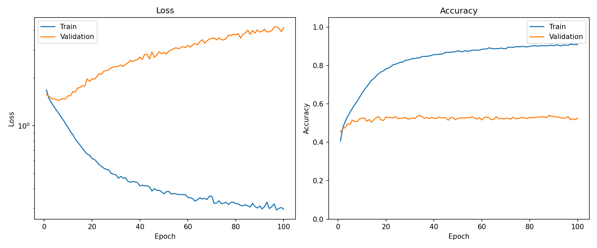

**Figure: Standard MLP matched, small scale (1.3M params)**
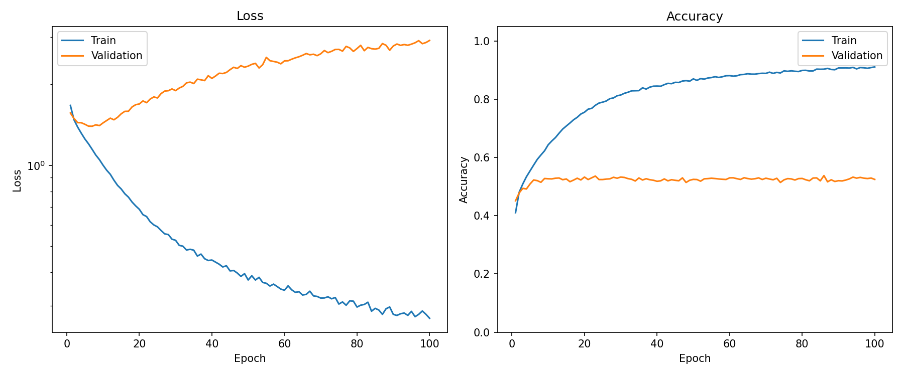

**Figure: Standard MLP matched, medium scale (3.0M params)**
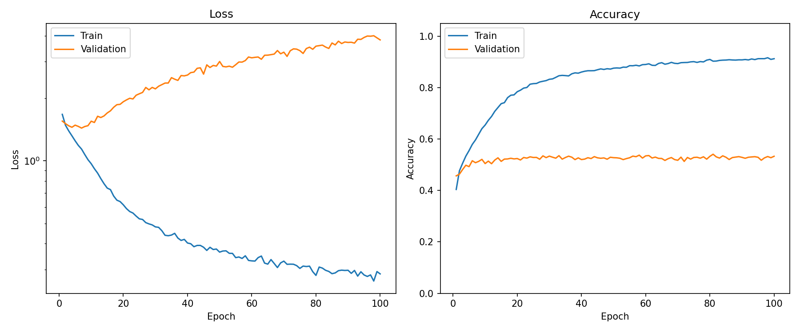

**Figure: Standard MLP matched, large scale (7.1M params)**
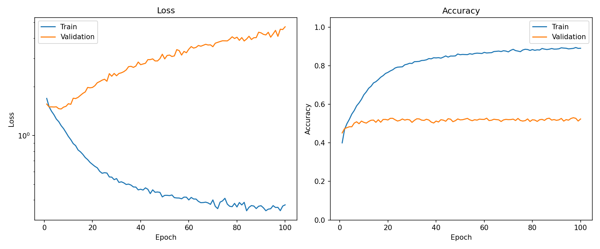

### Interpretation

The dense baselines behave as expected for flattened CIFAR-10.

They learn the training set increasingly well as scale increases, but test accuracy stays nearly flat around:

```text
52.7%–53.0%
```

The larger dense models do not improve test accuracy. Test loss gets worse as model size increases, suggesting stronger confidence overfitting rather than useful generalization.

This establishes a meaningful baseline: simply adding dense parameters did not solve the flattened-pixel problem.

## 2. Circle MLP

### Setup

The Circle MLP uses CircleLayer blocks.

Each CircleLayer learns two projection directions per unit and computes phase/radius features:

```text
a = x · u
b = x · v
r = sqrt(a² + b²)
sin(theta) = b / r
cos(theta) = a / r
```

The feature set includes:

```text
sin(theta)
cos(theta)
r
r * sin(theta)
r * cos(theta)
```

The layer then projects these features back into an ordinary hidden vector.

### Results

| Scale | Parameters | Best Val Acc | Test Acc | Test Loss | Mean Epoch Time |
|---|---:|---:|---:|---:|---:|
| small | 1,184,266 | 57.40% | 56.57% | 1.3953 | 12.86s |
| medium | 3,154,954 | 57.50% | 57.35% | 1.4153 | 12.49s |
| large | 9,455,626 | 57.86% | 58.32% | 2.6052 | 12.55s |

**Figure: Circle MLP, small scale (1.2M params)**
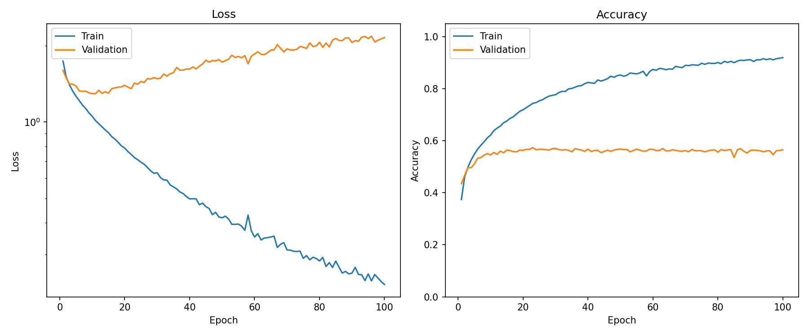

**Figure: Circle MLP, medium scale (3.2M params)**
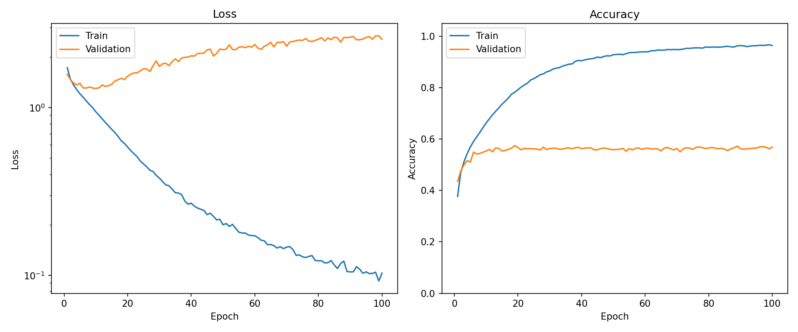

**Figure: Circle MLP, large scale (9.5M params)**
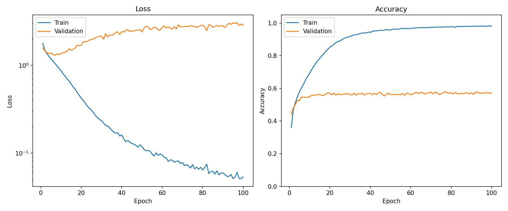

### Interpretation

Circle MLP is the cleanest positive result in this experiment.

At small scale, Circle MLP has fewer parameters than the small parameter-matched dense baseline:

```text
Circle MLP small:              1,184,266 parameters
Standard MLP matched small:    1,331,722 parameters
```

but achieves much better test accuracy:

```text
Circle MLP small:              56.57%
Standard MLP matched small:    52.90%
```

and much lower test loss:

```text
Circle MLP small:              1.3953
Standard MLP matched small:    2.7725
```

This makes the small Circle result especially important: it is not explained by having more parameters than the dense matched baseline.

Circle MLP also scales better than the dense baselines. Its test accuracy improves from:

```text
56.57% → 57.35% → 58.32%
```

across small, medium, and large scales.

The strongest cautious claim for Circle MLP is:

```text
CircleLayer appears to provide a useful feedforward feature transformation for flattened CIFAR-10 in this run.
```

## 3. Helix MLP

### Setup

The Helix MLP uses HelixLayer blocks.

Each HelixLayer learns a 3D subspace per unit and computes phase/radius/axis features:

```text
a = x · u
b = x · v
z = x · w
r = sqrt(a² + b²)
sin(theta) = b / r
cos(theta) = a / r
```

The feature set includes:

```text
sin(theta)
cos(theta)
r
z
r * sin(theta)
r * cos(theta)
tanh(z)
r * tanh(z)
```

The layer then projects these features back into an ordinary hidden vector.

### Results

| Scale | Parameters | Best Val Acc | Test Acc | Test Loss | Mean Epoch Time |
|---|---:|---:|---:|---:|---:|
| small | 1,807,114 | 56.92% | 56.68% | 1.9697 | 12.81s |
| medium | 4,859,402 | 57.72% | 57.93% | 2.3641 | 12.58s |
| large | 14,699,530 | 58.08% | 57.87% | 2.9340 | 12.62s |

**Figure: Helix MLP, small scale (1.8M params)**
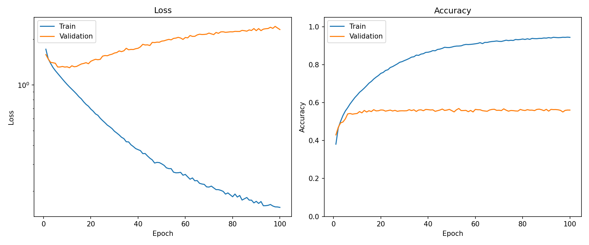

**Figure: Helix MLP, medium scale (4.9M params)**


**Figure: Helix MLP, large scale (14.7M params)**
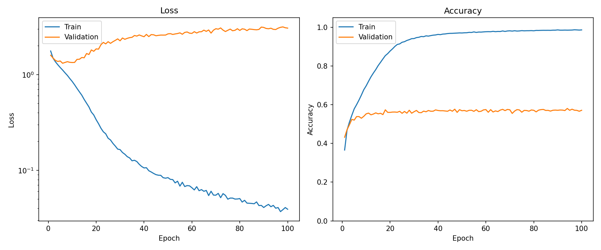

### Interpretation

Helix MLP also clearly outperforms the dense baselines.

Its best result is at medium scale:

```text
Helix MLP medium: 57.93% test accuracy
```

Compared with the parameter-matched dense baseline at the same scale:

```text
Helix MLP medium:              57.93%
Standard MLP matched medium:   52.97%
```

That is a gain of:

```text
+4.96 percentage points
```

However, Helix MLP does not clearly outperform Circle MLP on this task. Circle and Helix are close:

| Scale | Circle Test Acc | Helix Test Acc | Difference |
|---|---:|---:|---:|
| small | 56.57% | 56.68% | Helix +0.11 pts |
| medium | 57.35% | 57.93% | Helix +0.58 pts |
| large | 58.32% | 57.87% | Circle +0.45 pts |

The best overall model is Circle MLP large, not Helix MLP.

The cautious interpretation is:

```text
HelixLayer is competitive and substantially better than dense MLP baselines on flattened CIFAR-10, but this experiment does not show a clear helix-specific advantage over CircleLayer.
```

## 4. Scaling Behavior

The scaling behavior differs sharply between dense and geometric models.

Dense MLP test accuracy is effectively flat:

```text
standard_mlp:
small  53.02%
medium 52.89%
large  52.71%

standard_mlp_matched:
small  52.90%
medium 52.97%
large  52.74%
```

The geometric models improve with scale:

```text
circle_mlp:
small  56.57%
medium 57.35%
large  58.32%

helix_mlp:
small  56.68%
medium 57.93%
large  57.87%
```

Circle MLP shows the clearest monotonic scaling trend. Helix MLP improves from small to medium, then saturates or slightly declines at large scale.

This suggests that the geometric layers are using additional capacity more productively than the dense MLPs in this setup.

## 5. Overfitting and Loss Behavior

All models overfit. This is expected for flattened CIFAR-10 with fully connected networks and no augmentation.

The dense models show especially poor loss behavior as scale increases. Test accuracy stays near 53%, but test loss rises:

```text
standard_mlp:
small  2.1681
medium 3.0951
large  3.8857

standard_mlp_matched:
small  2.7725
medium 3.4432
large  3.9935
```

The geometric models also show increasing test loss at larger scales, but their accuracy is substantially higher:

```text
circle_mlp:
small  1.3953
medium 1.4153
large  2.6052

helix_mlp:
small  1.9697
medium 2.3641
large  2.9340
```

The lowest test loss in the full 100-epoch sweep is:

```text
Circle MLP small: 1.3953
```

The best test accuracy is:

```text
Circle MLP large: 58.32%
```

This suggests a tradeoff: larger geometric models improve accuracy but become less well-calibrated or more overconfident. Calibration should be tested directly before making claims about confidence quality.

## Main Takeaways

### 1. Geometric MLPs beat dense MLPs across all tested scales

Both Circle MLP and Helix MLP outperform both dense baselines at small, medium, and large scales.

The gains over the parameter-matched dense baseline range from:

```text
+3.67 to +5.58 percentage points for Circle MLP
+3.78 to +5.13 percentage points for Helix MLP
```

This is the strongest general-utility result so far in the project.

### 2. CircleLayer is the cleanest result

Circle MLP achieves the best overall test accuracy and has the strongest small-scale result.

At small scale, Circle MLP beats the parameter-matched dense baseline while using fewer parameters and achieving much lower test loss.

This result is difficult to dismiss as a parameter-count artifact.

### 3. HelixLayer is viable and strong, but not clearly better than CircleLayer

Helix MLP substantially beats dense MLP baselines, but Circle MLP is at least as compelling overall.

The additional axis-related features in HelixLayer do not show clear value over CircleLayer on this task.

### 4. Training rate is surprisingly similar across models

Mean epoch time stays in a narrow band:

```text
12.38s–12.86s
```

This means the accuracy gains from Circle MLP and Helix MLP did not come with an obvious wall-clock training penalty in this implementation.

This is important enough to track in future experiments.

### 5. Dense scaling fails here

The dense models do not improve test accuracy with scale. They mostly become more confident while generalizing no better.

This makes the geometric-layer gains more meaningful: the improvement is not simply due to increasing parameter count.

## Scope of the Claim

These results support the following claim:

```text
On seed 0 of flattened CIFAR-10 without convolution or augmentation, Circle MLP and Helix MLP outperform dense MLP baselines across small, medium, and large scales, while training at similar wall-clock epoch rates.
```

These results do **not** yet show:

- that geometric MLPs are better than CNNs;
- that HelixLayer is generally superior to CircleLayer;
- that the helix axis is causally useful on CIFAR-10;
- that the effect is stable across random seeds;
- that the models are FLOP-efficient;
- that the learned phase variables have interpretable semantic content;
- that the result will hold with augmentation, regularization changes, or different optimizers.

This is a strong single-seed architecture result, not a final claim.

## Recommended Next Steps

### 1. Repeat seed 1

The immediate next step should be another seed, especially at small and medium scale.

Recommended commands:

```bash
python cifar10_run_experiment.py --all-models --scale small --seed 1
python cifar10_run_experiment.py --all-models --scale medium --seed 1
```

If the dense-flat / geometric-better pattern repeats, the result becomes much harder to dismiss.

### 2. Run a no-axis Helix ablation

Because Circle MLP is so competitive, test whether HelixLayer's axis features are helping.

Ablations to run:

```text
helix_full
helix_no_axis
helix_raw_projection
helix_phase_radius
```

The important question is:

```text
Is HelixLayer winning because of phase/radius-style expansion, or because the axis/interactions add value?
```

### 3. Add calibration metrics

Test loss rises strongly in larger models. Add:

```text
expected calibration error
negative log likelihood
confidence histograms
accuracy vs confidence
```

This will clarify whether Circle small's low loss is a meaningful calibration advantage.

### 4. Profile compute more carefully

Mean epoch time is similar across models, but this should be checked with more direct profiling.

Measure:

```text
GPU utilization
forward time
backward time
data loading time
examples/sec
memory usage
approximate FLOPs
```

Do not claim compute efficiency until this is measured directly.

### 5. Proceed to tabular classification

If the result repeats across seeds, tabular classification becomes a strong next test.

Candidate datasets:

```text
Covertype
HIGGS
UCI Adult
Letter Recognition
Spambase
```

Tabular data removes image locality and has no obvious phase structure. If Circle/Helix MLPs remain competitive there, the argument for general utility becomes stronger.

## Source Artifacts

The main comparison file is:

```text
cifar10_results_comparison_all_scales_seed0.json
```

Per-model metric files:

```text
standard_mlp_small_seed0_metrics.json
standard_mlp_medium_seed0_metrics.json
standard_mlp_large_seed0_metrics.json

standard_mlp_matched_small_seed0_metrics.json
standard_mlp_matched_medium_seed0_metrics.json
standard_mlp_matched_large_seed0_metrics.json

circle_mlp_small_seed0_metrics.json
circle_mlp_medium_seed0_metrics.json
circle_mlp_large_seed0_metrics.json

helix_mlp_small_seed0_metrics.json
helix_mlp_medium_seed0_metrics.json
helix_mlp_large_seed0_metrics.json
```

Training history files are available for each run and include per-epoch loss, accuracy, epoch time, and examples per second.

## Summary

Flattened CIFAR-10 is a hard task for fully connected networks because it removes all spatial locality. Dense MLPs top out around 53% test accuracy regardless of scale, and adding parameters only increases overconfident miscalibration.

Circle MLP and Helix MLP both break through this ceiling, reaching 56–58% test accuracy across all three scales. The gains over the parameter-matched dense baseline range from +3.7 to +5.6 percentage points. Circle MLP is the standout: at small scale it uses fewer parameters than the matched dense baseline yet gains nearly 4 points; at large scale it achieves the best overall test accuracy of 58.32%.

Helix MLP is comparably strong but does not clearly surpass Circle MLP here. The additional axis features do not show a measurable advantage on this particular task.

Training speed was effectively identical across all models despite large differences in parameter count, so the accuracy gains came without a wall-clock penalty.

This is the first result in the project where geometric MLP layers outperform dense baselines on a standard, non-toy classification benchmark. The result is single-seed and should be confirmed with additional seeds and ablations before drawing broader conclusions.
