# Experimental Results: Covertype with Geometric MLP Layers

## Overview

This document summarizes the Covertype classification experiment for the structured-latents project.

The task is multiclass tabular classification:

```text
x ∈ R^54 → forest cover type ∈ {0, 1, 2, 3, 4, 5, 6}
```

Four feedforward model families were trained and evaluated:

1. **Standard MLP**, an ordinary dense neural baseline.
2. **Parameter-matched Standard MLP**, a wider dense baseline.
3. **Circle MLP**, using CircleLayer blocks with phase/radius features.
4. **Helix MLP**, using HelixLayer blocks with phase/radius/axis features.

Each model family was trained at three scales:

```text
small
medium
large
```

All reported runs used:

```text
dataset: Covertype
input: 54 tabular features
seed: 0
epochs: 100
```

The purpose of this experiment was not to beat all tabular machine-learning methods. Tree-based methods are often strong on tabular datasets. The purpose here was narrower: compare dense, Circle, and Helix feedforward neural primitives under the same local training setup.

The main result is mixed: **Helix MLP achieved the best absolute accuracy, macro F1, and test loss in this seed-0 scale sweep**, but it did so with substantially more parameters than the dense baselines. On a per-parameter basis, dense MLPs are more efficient. The geometric models appear to trade additional parameters for better final performance rather than getting more from each parameter.

## Dataset and Preprocessing

The experiment uses the Forest CoverType dataset. Each example contains 54 input features and a 7-class forest cover type label.

The input features are heterogeneous:

```text
10 continuous/cartographic features
44 binary indicator features
```

The intended preprocessing is:

1. split the data into train, validation, and test sets;
2. standardize the first 10 continuous features using train-set statistics only;
3. leave the remaining 44 binary features unchanged;
4. convert labels from 1-indexed to 0-indexed class IDs;
5. evaluate with metrics that account for class imbalance.

Because Covertype has imbalanced classes, macro F1 is treated as a primary metric alongside accuracy and loss.

## Model Definitions

### Standard MLP

The Standard MLP is a dense feedforward network:

```text
Linear(54, hidden_dim)
GELU
Dropout
Linear(hidden_dim, hidden_dim)
GELU
Dropout
Linear(hidden_dim, 7)
```

### Parameter-Matched Standard MLP

The matched dense baseline uses the same architecture, but a larger hidden dimension. This provides a stronger dense comparison for the geometric models, which generally have more parameters than the small dense baseline.

### Circle MLP

The Circle MLP uses CircleLayer blocks. Each CircleLayer learns two projection directions per unit:

```text
a = x · u
b = x · v
r = sqrt(a² + b²)
sin(theta) = b / r
cos(theta) = a / r
```

The feature set is:

```text
sin(theta)
cos(theta)
r
r * sin(theta)
r * cos(theta)
```

The concatenated features are projected back into an ordinary hidden vector.

### Helix MLP

The Helix MLP uses HelixLayer blocks. Each HelixLayer learns three projection directions per unit:

```text
a = x · u
b = x · v
z = x · w
r = sqrt(a² + b²)
sin(theta) = b / r
cos(theta) = a / r
```

The feature set is:

```text
sin(theta)
cos(theta)
r
z
r * sin(theta)
r * cos(theta)
tanh(z)
r * tanh(z)
```

The layer therefore includes phase, radius, raw projection, and axis-related features.

## Summary of Results

| Model | Scale | Parameters | Best Val Macro F1 | Test Accuracy | Test Macro F1 | Test Weighted F1 | Test Loss | Mean Epoch Time |
|---|---|---:|---:|---:|---:|---:|---:|---:|
| Standard MLP | small | 8,135 | 0.8485 | 88.78% | 0.8403 | 0.8871 | 0.2782 | 3.90s |
| Standard MLP matched | small | 15,271 | 0.8789 | 90.69% | 0.8746 | 0.9067 | 0.2303 | 3.70s |
| Circle MLP | small | 28,999 | 0.8710 | 91.18% | 0.8622 | 0.9115 | 0.2216 | 4.77s |
| Helix MLP | small | 45,127 | 0.8912 | 92.33% | 0.8818 | 0.9233 | 0.1883 | 5.13s |
| Standard MLP | medium | 24,455 | 0.8964 | 92.33% | 0.8928 | 0.9232 | 0.1962 | 3.91s |
| Standard MLP matched | medium | 48,967 | 0.9148 | 93.49% | 0.9092 | 0.9348 | 0.1632 | 4.13s |
| Circle MLP | medium | 107,143 | 0.9118 | 93.76% | 0.9071 | 0.9375 | 0.1523 | 5.07s |
| Helix MLP | medium | 168,071 | 0.9234 | 94.84% | 0.9203 | 0.9484 | 0.1284 | 5.34s |
| Standard MLP | large | 81,671 | 0.9191 | 94.05% | 0.9170 | 0.9404 | 0.1488 | 4.35s |
| Standard MLP matched | large | 171,655 | 0.9276 | 94.76% | 0.9244 | 0.9476 | 0.1333 | 4.40s |
| Circle MLP | large | 410,887 | 0.9279 | 95.06% | 0.9231 | 0.9506 | 0.1210 | 5.23s |
| Helix MLP | large | 647,431 | **0.9358** | **95.75%** | **0.9318** | **0.9575** | **0.1061** | 5.26s |

The best overall result was:

```text
Helix MLP, large scale
Test accuracy: 95.75%
Test macro F1: 0.9318
Test loss:     0.1061
```

## Main Result

The Helix MLP was the strongest model in this seed-0 scale sweep.

At large scale, Helix MLP outperformed the large parameter-matched dense baseline:

| Metric | Standard MLP matched, large | Helix MLP, large | Difference |
|---|---:|---:|---:|
| Test accuracy | 94.76% | **95.75%** | +0.99 points |
| Test macro F1 | 0.9244 | **0.9318** | +0.0074 |
| Test weighted F1 | 0.9476 | **0.9575** | +0.0099 |
| Test loss | 0.1333 | **0.1061** | -0.0272 |
| Mean epoch time | **4.40s** | 5.26s | +0.86s |

Helix MLP improved over the matched dense baseline on the primary metrics. However, the large Helix MLP has nearly 4x the parameters of the large matched dense baseline (647K vs 172K). The parameter efficiency analysis shows that dense MLPs get more error reduction per parameter, so the Helix accuracy advantage may be explained by having more capacity rather than by a structural advantage of the geometric features.

The result should be interpreted cautiously: it is a single seed, and the parameter gap means ablations and tighter parameter matching are needed before claiming a structural benefit from the geometric layers.

## 1. Dense MLP Baselines

### Results

| Model | Scale | Parameters | Test Accuracy | Test Macro F1 | Test Loss | Mean Epoch Time |
|---|---|---:|---:|---:|---:|---:|
| Standard MLP | small | 8,135 | 88.78% | 0.8403 | 0.2782 | 3.90s |
| Standard MLP | medium | 24,455 | 92.33% | 0.8928 | 0.1962 | 3.91s |
| Standard MLP | large | 81,671 | 94.05% | 0.9170 | 0.1488 | 4.35s |
| Standard MLP matched | small | 15,271 | 90.69% | 0.8746 | 0.2303 | 3.70s |
| Standard MLP matched | medium | 48,967 | 93.49% | 0.9092 | 0.1632 | 4.13s |
| Standard MLP matched | large | 171,655 | 94.76% | 0.9244 | 0.1333 | 4.40s |

**Figure: Standard MLP, small scale (8.1K params)**
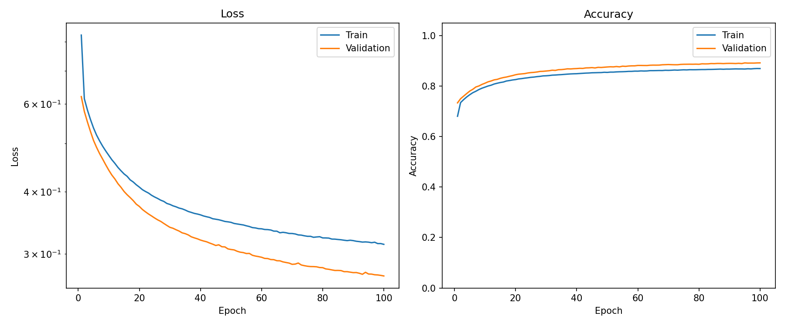

**Figure: Standard MLP, medium scale (24.5K params)**
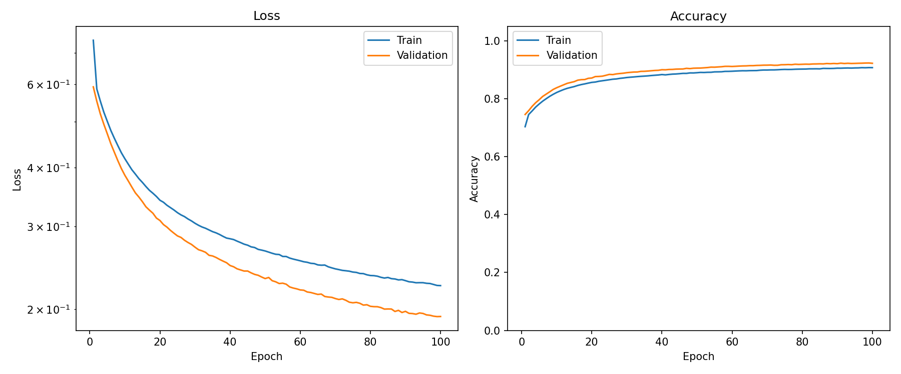

**Figure: Standard MLP, large scale (81.7K params)**
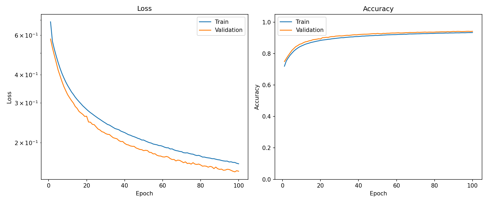

**Figure: Standard MLP matched, small scale (15.3K params)**
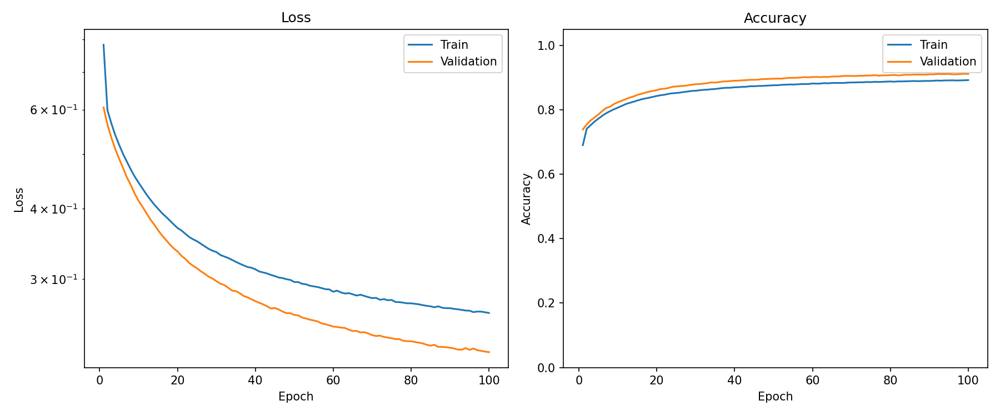

**Figure: Standard MLP matched, medium scale (49.0K params)**
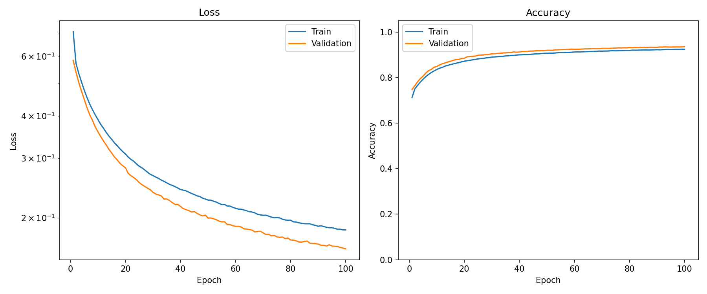

**Figure: Standard MLP matched, large scale (171.7K params)**
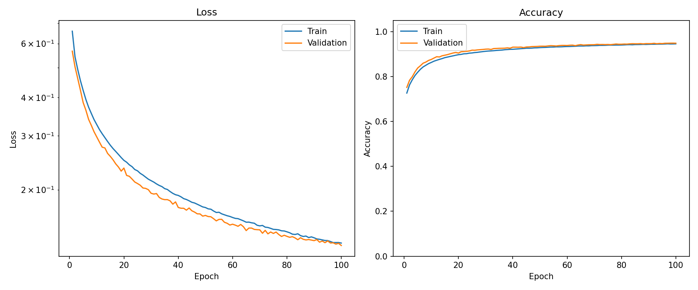

### Interpretation

The dense baselines are strong on Covertype.

Unlike the flattened CIFAR-10 experiment, where dense MLP scaling was relatively flat, dense MLPs improved clearly with additional capacity on Covertype. Both the ordinary dense model and the matched dense model improved from small to medium to large scale.

The large parameter-matched dense model is therefore a meaningful baseline:

```text
Test accuracy: 94.76%
Test macro F1: 0.9244
Test loss:     0.1333
```

Any claim about geometric-layer advantage should be judged primarily against this stronger dense baseline, not only against the smaller Standard MLP.

## 2. Circle MLP

### Results

| Scale | Parameters | Test Accuracy | Test Macro F1 | Test Loss | Mean Epoch Time |
|---|---:|---:|---:|---:|---:|
| small | 28,999 | 91.18% | 0.8622 | 0.2216 | 4.77s |
| medium | 107,143 | 93.76% | 0.9071 | 0.1523 | 5.07s |
| large | 410,887 | 95.06% | 0.9231 | 0.1210 | 5.23s |

**Figure: Circle MLP, small scale (29.0K params)**
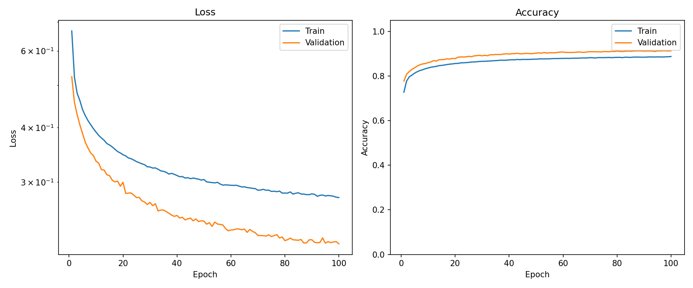

**Figure: Circle MLP, medium scale (107.1K params)**
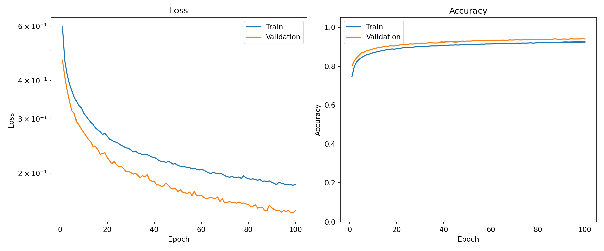

**Figure: Circle MLP, large scale (410.9K params)**
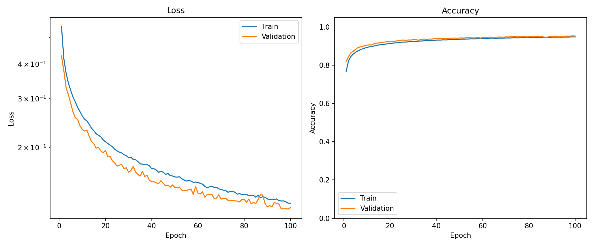

### Interpretation

Circle MLP trained successfully and scaled well. It outperformed the ordinary Standard MLP at every scale on test accuracy and test loss.

Compared with the parameter-matched dense baseline, the picture is more mixed:

| Scale | Circle Test Accuracy | Matched Dense Test Accuracy | Circle Test Macro F1 | Matched Dense Test Macro F1 |
|---|---:|---:|---:|---:|
| small | 91.18% | 90.69% | 0.8622 | 0.8746 |
| medium | 93.76% | 93.49% | 0.9071 | 0.9092 |
| large | 95.06% | 94.76% | 0.9231 | 0.9244 |

Circle MLP slightly exceeded the matched dense baseline in test accuracy at every scale, but did not exceed it in macro F1. Since macro F1 is a primary metric for this dataset, Circle MLP should be described as competitive rather than clearly superior.

The large Circle MLP also had lower test loss than the large matched dense model:

```text
Circle MLP large:             0.1210
Standard MLP matched large:   0.1333
```

This suggests that CircleLayer may improve probability quality or confidence behavior in this run, but calibration-specific metrics would be needed before making a calibration claim.

## 3. Helix MLP

### Results

| Scale | Parameters | Test Accuracy | Test Macro F1 | Test Loss | Mean Epoch Time |
|---|---:|---:|---:|---:|---:|
| small | 45,127 | 92.33% | 0.8818 | 0.1883 | 5.13s |
| medium | 168,071 | 94.84% | 0.9203 | 0.1284 | 5.34s |
| large | 647,431 | **95.75%** | **0.9318** | **0.1061** | 5.26s |

**Figure: Helix MLP, small scale (45.1K params)**
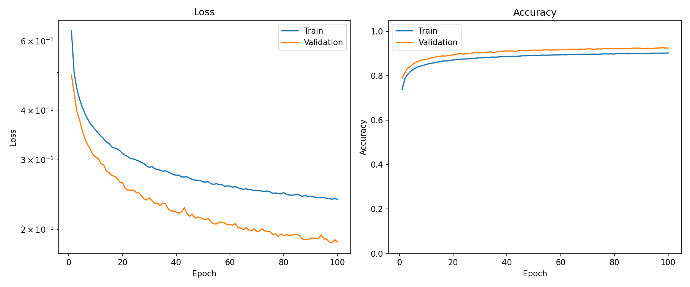

**Figure: Helix MLP, medium scale (168.1K params)**
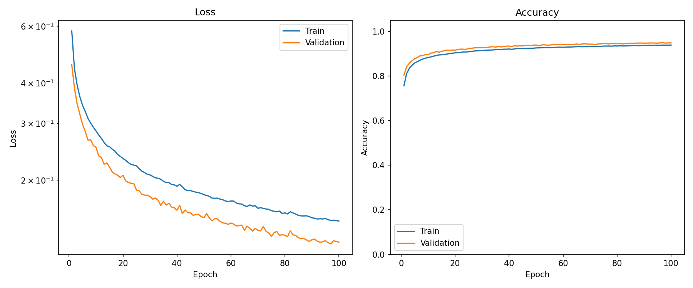

**Figure: Helix MLP, large scale (647.4K params)**
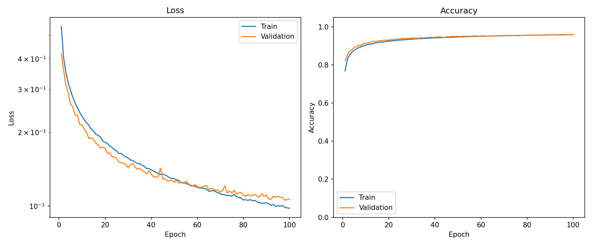

### Interpretation

Helix MLP achieved the highest absolute accuracy, macro F1, and lowest test loss in this experiment. It also has the most parameters at every scale.

It improved consistently across scale:

```text
Test accuracy:  92.33% → 94.84% → 95.75%
Macro F1:       0.8818 → 0.9203 → 0.9318
Test loss:      0.1883 → 0.1284 → 0.1061
```

At medium scale, Helix MLP already outperformed the medium parameter-matched dense baseline:

| Metric | Matched Dense medium | Helix medium |
|---|---:|---:|
| Test accuracy | 93.49% | **94.84%** |
| Test macro F1 | 0.9092 | **0.9203** |
| Test loss | 0.1632 | **0.1284** |

At large scale, Helix MLP achieved the best overall result in the experiment.

The large Helix MLP also outperformed the large Circle MLP:

| Metric | Circle large | Helix large |
|---|---:|---:|
| Test accuracy | 95.06% | **95.75%** |
| Test macro F1 | 0.9231 | **0.9318** |
| Test loss | 0.1210 | **0.1061** |

This is notable because earlier experiments sometimes showed Circle MLP matching or exceeding Helix MLP. However, the Helix MLP also has substantially more parameters than Circle MLP at each scale (e.g., 647K vs 411K at large). The Helix-over-Circle advantage may reflect additional capacity rather than axis-feature utility. Feature ablations are needed before claiming the axis features are causally helpful.

## 4. Scaling Behavior

All model families improved with scale. The Helix MLP achieved the highest absolute metrics, but also had the most parameters at each scale. Dense MLPs scaled well on this dataset, unlike on flattened CIFAR-10 where dense scaling was flat.

### Test Accuracy by Scale

| Model | Small | Medium | Large |
|---|---:|---:|---:|
| Standard MLP | 88.78% | 92.33% | 94.05% |
| Standard MLP matched | 90.69% | 93.49% | 94.76% |
| Circle MLP | 91.18% | 93.76% | 95.06% |
| Helix MLP | **92.33%** | **94.84%** | **95.75%** |

### Test Macro F1 by Scale

| Model | Small | Medium | Large |
|---|---:|---:|---:|
| Standard MLP | 0.8403 | 0.8928 | 0.9170 |
| Standard MLP matched | 0.8746 | 0.9092 | 0.9244 |
| Circle MLP | 0.8622 | 0.9071 | 0.9231 |
| Helix MLP | **0.8818** | **0.9203** | **0.9318** |

### Test Loss by Scale

| Model | Small | Medium | Large |
|---|---:|---:|---:|
| Standard MLP | 0.2782 | 0.1962 | 0.1488 |
| Standard MLP matched | 0.2303 | 0.1632 | 0.1333 |
| Circle MLP | 0.2216 | 0.1523 | 0.1210 |
| Helix MLP | **0.1883** | **0.1284** | **0.1061** |

The Helix MLP was best at all three scales on test accuracy and test loss, and best at all three scales on macro F1 except for a small-scale comparison where it also exceeded the other listed models. Circle MLP was competitive but did not clearly exceed the matched dense baseline on macro F1.

## 5. Training Rate

Mean epoch time increased for the geometric models. The large Helix MLP had the highest parameter count and was slower than the dense baselines, but not dramatically slower than Circle MLP.

| Model | Scale | Parameters | Mean Epoch Time |
|---|---|---:|---:|
| Standard MLP | large | 81,671 | 4.35s |
| Standard MLP matched | large | 171,655 | 4.40s |
| Circle MLP | large | 410,887 | 5.23s |
| Helix MLP | large | 647,431 | 5.26s |

The large Helix MLP took approximately 20% longer per epoch than the large matched dense baseline:

```text
5.26s vs 4.40s
```

This makes the Covertype result different from the flattened CIFAR-10 result, where epoch times were very similar across model families. Here, the performance improvement comes with a measurable but moderate epoch-time cost.

A stronger compute-efficiency claim would require additional profiling, including FLOPs, memory bandwidth, and hardware utilization.

## Parameter Efficiency: Negative Log Accuracy Error per Parameter

To compare parameter efficiency, we also compute a higher-is-better metric:

```text
negative log accuracy error per parameter
```

This metric increases when a model gets more accuracy-error reduction per parameter. It should be interpreted as an auxiliary efficiency signal, not as a replacement for accuracy, macro F1, or test loss.

| Model                | Scale  | Neg-log accuracy error per parameter |
| -------------------- | ------ | -----------------------------------: |
| Standard MLP         | small  |                         **9.79e-05** |
| Standard MLP         | medium |                         **3.97e-05** |
| Standard MLP         | large  |                         **1.32e-05** |
| Standard MLP matched | small  |                             5.90e-05 |
| Standard MLP matched | medium |                             2.13e-05 |
| Standard MLP matched | large  |                             6.53e-06 |
| Circle MLP           | small  |                             2.97e-05 |
| Circle MLP           | medium |                             9.63e-06 |
| Circle MLP           | large  |                             2.71e-06 |
| Helix MLP            | small  |                             2.06e-05 |
| Helix MLP            | medium |                             6.54e-06 |
| Helix MLP            | large  |                             1.80e-06 |

Across all three scales, the small Standard MLP has the highest value on this metric, and within each scale the dense baselines are more parameter-efficient than the geometric models. This changes the interpretation: the geometric models achieve higher absolute accuracy and macro F1 by using more parameters, not by producing more error reduction per parameter.

At large scale, the ranking is:

| Rank | Model                |        Value |
| ---: | -------------------- | -----------: |
|    1 | Standard MLP         | **1.32e-05** |
|    2 | Standard MLP matched |     6.53e-06 |
|    3 | Circle MLP           |     2.71e-06 |
|    4 | Helix MLP            |     1.80e-06 |

The parameter-efficiency result therefore tempers the main accuracy result. Helix MLP is the strongest model by accuracy, macro F1, and test loss in this seed-0 Covertype run, but it is not the most parameter-efficient. The dense MLP baselines get more error reduction per parameter, while the geometric models appear to trade additional parameters for better final performance.

## 6. Per-Class Behavior

Per-class accuracy shows that the larger models improve not only overall accuracy but also performance on weaker classes.

The hardest class in the dense baselines was class 4. Its per-class accuracy improved with scale and model family:

| Model | Scale | Class 4 Accuracy |
|---|---:|---:|
| Standard MLP | small | 61.80% |
| Standard MLP | medium | 77.60% |
| Standard MLP | large | 82.30% |
| Standard MLP matched | large | 86.38% |
| Circle MLP | large | 86.17% |
| Helix MLP | large | **88.55%** |

The large Helix MLP also showed strong per-class accuracy on the other classes:

| Class | Helix MLP large per-class accuracy |
|---:|---:|
| 0 | 95.59% |
| 1 | 96.21% |
| 2 | 96.38% |
| 3 | 88.83% |
| 4 | 88.55% |
| 5 | 93.32% |
| 6 | 96.17% |

The improvement on class 4 is important because macro F1 weights each class equally. This helps explain why the large Helix MLP achieved the best macro F1.

## 7. Scope of the Claim

These results support the following claims:

```text
All geometric models trained stably on Covertype.
Helix MLP achieved the best absolute accuracy, macro F1, weighted F1, and test loss in this seed-0 scale sweep.
Circle MLP was competitive with the matched dense baseline but did not clearly beat it on macro F1.
Dense MLPs are strong on this dataset and improve substantially with scale.
Dense MLPs are more parameter-efficient than the geometric models.
The geometric models achieve higher absolute performance by using more parameters, not by using parameters more efficiently.
```

These results do not prove:

```text
HelixLayer is generally superior to dense layers.
The geometric models have a structural advantage over dense layers on tabular data.
Tabular data has natural helical structure.
The learned helix axis has causal or semantic meaning.
The result is stable across random seeds.
The model is more compute-efficient than dense baselines.
The model beats tree-based tabular methods.
```

The strongest cautious interpretation is:

```text
CircleLayer and HelixLayer are viable feedforward primitives for heterogeneous tabular classification. In this seed-0 Covertype sweep, Helix MLP achieved the best absolute metrics, but dense MLPs were more parameter-efficient. The accuracy advantage may come from additional capacity rather than geometric structure.
```

## 8. Relationship to Prior Experiments

The project progression is now:

```text
Experiment 1: Modular addition
  Explicit circular/helix latent interventions on a cyclic task.

Experiment 2: MNIST
  Viability of CircleLayer and HelixLayer on simple image classification.

Experiment 3: Flattened CIFAR-10
  Geometric MLP layers outperform dense baselines on hard flattened-pixel classification.

Experiment 4: Covertype
  Helix MLP outperforms dense and Circle baselines on heterogeneous tabular classification in a seed-0 scale sweep.
```

Covertype is the first non-image-origin benchmark in the ladder. The geometric models trained stably and achieved strong absolute performance, but the parameter efficiency analysis shows that their advantage may come from having more parameters rather than from geometric structure. This makes the Covertype result weaker evidence for structural utility of the geometric layers than the flattened CIFAR-10 result, where dense scaling was flat.

## 9. Recommended Follow-Ups

### 1. Multi-seed confirmation

The top priority is to repeat the medium and large comparisons across multiple seeds:

```text
seeds = 0, 1, 2, 3, 4
```

Report mean and standard deviation for:

```text
test accuracy
test macro F1
test loss
mean epoch time
```

A strong architecture claim should wait for this confirmation.

### 2. Feature ablations

The large Helix MLP outperformed Circle MLP, suggesting that axis-related features may help on Covertype. This requires ablation.

Recommended Helix ablations:

```text
full
no_axis
phase_radius
raw_projection
axis_only
```

Recommended Circle ablations:

```text
full
phase_only
radius_only
raw_projection
```

These are especially important because some features correspond to raw learned projections:

```text
r * sin(theta) = b
r * cos(theta) = a
```

Ablations should separate the value of normalized geometric features from ordinary projection capacity.

### 3. Parameter and compute matching

The large Helix MLP has substantially more parameters than the large matched dense baseline:

```text
Helix MLP large:             647,431 parameters
Standard MLP matched large:  171,655 parameters
```

Future comparisons should include either tighter parameter matching, accuracy-vs-parameter curves, or compute-normalized comparisons.

### 4. Optional tree baseline

For context, a simple tree-based baseline could be added:

```text
RandomForestClassifier
HistGradientBoostingClassifier
```

These should be reported as context only. The primary comparison in this experiment remains neural feedforward architecture families.

## Conclusion

The Covertype experiment produced a mixed result.

On absolute metrics, Helix MLP was the best model: it achieved the highest test accuracy (95.75%), macro F1 (0.9318), and lowest test loss (0.1061) at large scale. Circle MLP was competitive with the matched dense baseline but did not clearly surpass it on macro F1.

However, the dense baselines were strong and scaled well — unlike on flattened CIFAR-10, where dense accuracy was flat. On a per-parameter basis, dense MLPs were more efficient. The geometric models achieved their accuracy advantage by using substantially more parameters (Helix large: 647K vs matched dense large: 172K), not by getting more from each parameter.

The key takeaway is:

```text
On Covertype, CircleLayer and HelixLayer are viable tabular feedforward primitives. Helix MLP achieved the best absolute metrics, but dense MLPs were more parameter-efficient. The geometric advantage may reflect additional capacity rather than structural benefit.
```

The next steps are: (1) multi-seed confirmation, (2) feature ablations to determine whether the geometric features are doing useful work or whether the models are winning on raw projection capacity, and (3) tighter parameter matching to separate capacity effects from architecture effects.
