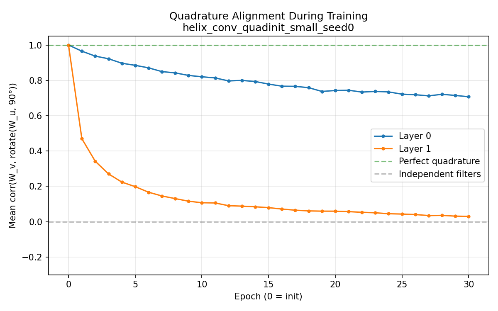
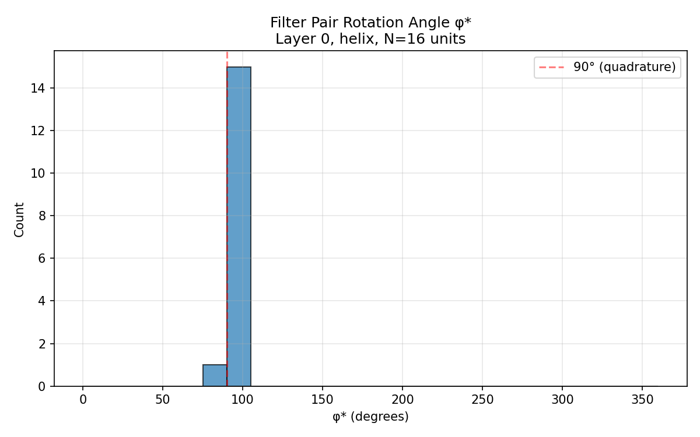

# Experiment 6 Results: Quadrature Initialization and Regularization

## Outcome

**"Never found", not "actively repelled" — with a caveat at depth.** The
quadrature structure is broadly compatible with the classification loss:
softly regularized models hold near-perfect quadrature at no meaningful
accuracy cost, and an initialized layer-0 quadrature survives 30 epochs of
unconstrained training (alignment 1.0 → 0.71, all 16 units still at
φ* = 90°). But the structure confers no advantage — all variants land at
the same accuracy — and at layer 1 the imposed structure erodes almost
completely. Gradient descent neither needs the geometry nor, at the first
layer, bothers to remove it.

## Setup

Identical to Experiment 5 (rotated MNIST ±180°, small scale, seed 0,
30 epochs, AdamW lr=1e-3 wd=1e-4, kernel 5). Three variants, all 63,642
parameters. See [quadrature_experiment.md](quadrature_experiment.md).

## Accuracy

| Model | Best Val | Test Rot | Test Unrot | Best Epoch |
|---|---|---|---|---|
| helix_conv (control) | 96.54% | 96.39% | 96.95% | 29 |
| helix_conv_quadinit | 96.62% | 96.15% | 96.60% | 29 |
| helix_conv_quadreg (λ=0.1) | 96.48% | 96.12% | 96.17% | 26 |

All three are equivalent to within a few tenths of a point (single seed; the
control's ex5 run scored 96.36% rotated, inside the same band). Quadrature
structure neither helps nor measurably hurts.

## Quadrature Alignment Trace

Mean per-unit correlation between `W_v` and `rotate(W_u, 90°)`, recorded at
init and after every epoch:

| Model | Layer | Init | Epoch 5 | Epoch 15 | Epoch 30 (final) |
|---|---|---|---|---|---|
| control | 0 | −0.02 | 0.02 | 0.04 | **0.07** |
| control | 1 | 0.00 | 0.01 | −0.02 | **−0.01** |
| quadinit | 0 | 1.00 | 0.87 | 0.76 | **0.71** |
| quadinit | 1 | 1.00 | 0.16 | 0.07 | **0.03** |
| quadreg | 0 | −0.02 | 1.00 | 1.00 | **1.00** |
| quadreg | 1 | 0.00 | 0.98 | 0.98 | **0.98** |

Three distinct behaviors:

1. **Control:** alignment never leaves zero. Replicates ex5 — no spontaneous
   organization.
2. **Quadinit, layer 0:** decays from 1.0 but *plateaus* around 0.71 — the
   decay rate flattens markedly after epoch ~15 (0.74 → 0.71 over the last
   15 epochs vs 1.0 → 0.74 over the first 15). The structure is degraded but
   substantially retained.
3. **Quadinit, layer 1:** collapses within 5 epochs (1.0 → 0.16) to control
   levels. Whatever layer 1 needs, it is not quadrature over its (already
   mixed) input channels.
4. **Quadreg:** λ=0.1 wins almost completely against the task gradient —
   alignment ≈ 1.00 / 0.98 from epoch 1 onward, at no accuracy cost. The
   task loss puts up essentially no fight.

## Final φ* Filter Analysis (ex5 Measurement 2)

| Model | Mean corr* | Fraction φ* near 90° |
|---|---|---|
| control | 0.44 | 1/16 |
| quadinit | 0.72 | **16/16** |
| quadreg | 1.00 | **16/16** |

For quadinit, every layer-0 unit still has its best-correlation angle at
90° after 30 unconstrained epochs — the pairs blurred (corr* 0.49–0.93)
but did not rotate away or decorrelate to control levels (control mean 0.44
with scattered angles; quadinit mean 0.72 with all angles at 90°).

## Interpretation

The two hypotheses from the design doc:

- **"No basin" (loss actively repels quadrature):** contradicted at layer 0.
  If the loss gradient pointed away from the quadrature manifold, quadinit's
  alignment would decay to control levels, as it does at layer 1, and quadreg
  would either fail to reach alignment or pay for it in accuracy. Instead,
  layer-0 structure largely persists unconstrained, and a mild λ=0.1 holds
  it at 1.0 for free.
- **"Never found" (flat/neutral region, unreachable from random init):**
  supported at layer 0. The quadrature manifold is approximately a neutral
  plateau: gradient descent placed on it wanders off slowly (driven by
  weight decay and gradient noise more than by any task signal), placed near
  it with a soft spring it stays exactly on it, and placed far from it never
  approaches (control alignment stays at 0).

The layer-1 collapse adds a refinement: quadrature in *pixel space* is
approximately neutral, but quadrature over layer-0's learned feature
channels is not a solution the task tolerates passively — it is removed
quickly. The geometric prior only even makes sense where the input has the
matching symmetry.

The verdict on the project's central question is unchanged but sharpened:
the helical geometry is *permitted* but not *preferred*. There is no
optimization pressure toward phase-as-orientation — only an absence of
pressure against it at the input layer. Equal accuracy everywhere confirms
the network has no use for the structure; it simply doesn't object to it.

## Caveats

Single seed, small scale, one λ value. The quadinit layer-0 plateau at 0.71
could continue decaying over longer training; 30 epochs bounds the decay
rate, not the asymptote.
